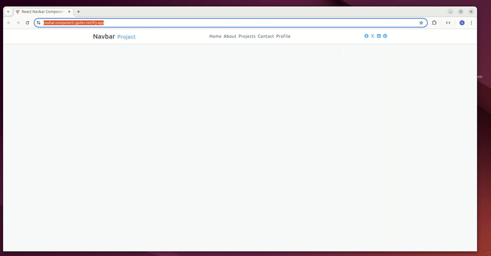
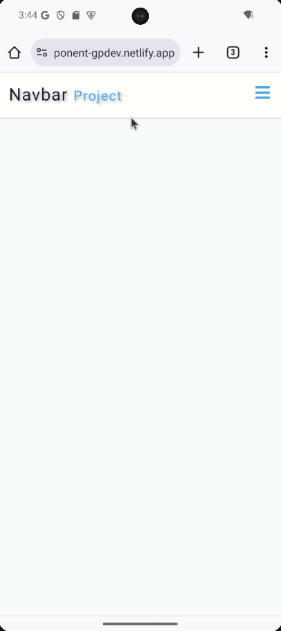

# React Navbar Component 🧭


A modern, responsive navigation bar component built with React. Features smooth animations, dynamic height calculation, and mobile-first responsive design. Perfect for practicing React hooks, CSS transitions, and responsive UI development.

## 🚀 Live Demo

**View Live on Netlify:**  
[React Navbar Demo ](https://navbar-component-gpdev.netlify.app/)

## 📸 Project Preview

<table align="center">
  <tr>
    <td align="center"><strong>💻 Desktop View</strong></td>
  </tr>
  <tr>
    <td align="center"></td>
  </tr>
  
  <tr>
    <td align="center"><strong>📱 Mobile View</strong></td>
  </tr>
  <tr>
    <td align="center"></td>
  </tr>
  <tr>
    <td align="center"><em>Mobile responsive view </em></td>
  </tr>
</table>

## 🎨 Design

- **Base Design:** Figma design provided by the course instructor.
  [View Original Figma Design](https://www.figma.com/file/Se61eLfK50x0JatmdSdLzL/Navbar?node-id=0%3A1&t=iDQ4v9bsLeblAFUK-1)
- **Customization:** The SVG logo from the course materials was replaced with a custom text title for public use, focusing on original branding and avoiding dependency on tutorial assets.

## ✨ Features

- **Responsive Design** -Mobile-first approach with smooth breakpoints
- **Dynamic Height Animation** -Menu expands/collapses with precise height calculation
- **Smooth Transitions**- CSS transitions for polished user experience
- **Social Media Integration**- Built-in social icons with external linking
- **Custom Branding**- Personalized logo/title component
- **Accessible Navigation**-Semantic HTML and keyboard navigation support

## 🎯 Component Highlights:

- Implements dynamic height calculation using React refs and getBoundingClientRect()
- Features smooth expand/collapse animations with CSS transitions
- Responsive design that adapts from mobile to desktop seamlessly
- Includes both navigation links and social media integration
- Clean, modern UI with hover effects and visual feedback

👥 Perfect For:

- 🏢 Website headers and navigation systems

- 📱 Mobile-responsive web applications

- 🎨 UI component libraries

- 📚 React learning projects and portfolio pieces

- 🔧 Developers needing a customizable navbar component

## 🛠️ Built With

| Tool / Library         | Purpose                               |
| ---------------------- | ------------------------------------- |
| ⚡ **Vite**            | Fast build tool & dev server          |
| ⚛️ **React 19**        | Component-based UI                    |
| 📋 **React Icons**     | Social media icon library             |
| 🎨 **CSS3**            | Flexbox, Grid, animations             |
| 📜 **JavaScript ES6+** | Modern language features              |
| 🎯 **React Hooks**     | useState, useRef for state management |

## 🎓 Key Learning Outcomes & Implemented Concepts

### State Management & React Hooks

- **Proficient use of the useState Hook** for managing menu visibility state and toggle functionality
- **Implemented useRef Hook** for DOM access and dynamic height calculations
- **Dynamic style application** using inline styles based on component state

### Responsive Design & Animation

- **Mobile-first responsive design** with CSS media queries
- **Smooth CSS transitions** for menu expand/collapse animations
- **Dynamic height calculation** using `getBoundingClientRect()` for precise animations
- **Hover effects and visual feedback** for improved user experience

### Component Architecture

- **Modular component structure** with clear separation of concerns
- **Data-driven rendering** using arrays for navigation and social links
- **Conditional rendering** based on screen size and user interaction
- **External link handling** with proper attributes for security

### UI/UX Best Practices

- **Accessible navigation** with semantic HTML structure
- **Visual feedback** through button rotation animations
- **Responsive typography** and spacing
- **Cross-browser compatible** CSS transitions

## 📦 Project Structure

```text
src/
├── components/
│   └── Navbar.jsx
├── data.jsx
├── App.jsx
└── index.css
```

## 🚀 Getting Started

### Prerequisites

- **Node.js** ≥ 18.0.0
- **npm** or **yarn** package manager

### Installation

1. Clone the repository

```bash
git clone https://github.com/pro804/React-Navbar-Component.git
```

2. Navigate to the project directory

```bash
cd React-Navbar-Component
```

3. Install dependencies

```bash
npm install
```

4. Start the development server

```bash
npm run dev
```

5. Open http://localhost:5173 to view it in the browser.

## 🔧 Available Scripts

- `npm run dev` — Runs the development server (Vite)
- `npm run build` — Builds the app for production
- `npm run preview` — Previews the production build locally

## 📄 License

This project was created for educational purposes as part of a React learning journey.
This project is licensed under the MIT License.
See the [LICENSE](LICENSE) file for details.
